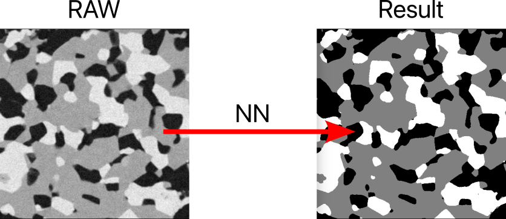

# Schedule for project meetings 
You can find the schedule for the next project meetings in this link:
https://docs.google.com/spreadsheets/d/1v-03Ygty5hSrs0qHAoLqmFP2TPtzqfeiryi3oHyiVYE/edit?usp=sharing

Please fill in when you wish to meet and try to coordinate for not being too many in a single time slot. Since many of you don’t know their group number, it is enough to write the student number of one member. The schedule will start from next Monday. 

All meetings that were previously scheduled in other time slots will still take place!

# Automating the Segmentation of X-ray Images with Deep Neural Networks

## Description 

In an era of rapid advancements in X-ray physics and the growing capabilities of X-ray synchrotron sources, the analysis of tomographic X-ray datasets has become increasingly critical in various scientific, medical, and industrial applications. However, once the raw data are collected, manually segmenting these images is a time-consuming and error-prone process, often plagued by uncertainties and subjectivity. Automating the segmentation process becomes imperative to keep pace with data acquisition rates and to ensure timely scientific discoveries and industrial insights. To address this challenge, in this project, we plan to leverage the power of deep neural networks to automate the segmentation of ptychographic X-ray images, removing the need for human intervention and significantly expediting the analysis process.
The primary objective is the development and training of a deep neural network, based on existing architectures, commonly used for other computer vision tasks (e.g. UNet, VGGnet, etc.) The training dataset consists of real-world X-ray images (raw and segmented), and the results will be benchmarked against manually labeled datasets.  The project will be supervised by Salvatore De Angelis (sdea@dtu.dk ) and Peter Stanley Jørgensen (psjq@dtu.dk)

## Example data 
Below is an example of a ptychographic two-dimensional slice obtained from the entire tomogram. Despite the high data quality, simple thresholding methods fail to accurately segment the three phases. The goal is to delegate this task to a properly trained deep neural network. 

## Requirements 
The student should be familiar with either Keras (Tensorflow) or Pytorch. Basic knowledge of Python is also required for the initial data processing and final analysis

## References 
The possible outcomes of the segmentation of this kind of data can be found in the following references:

1. De Angelis, S. et al. Three dimensional characterization of nickel coarsening in solid oxide cells via ex-situ ptychographic nano-tomography. Journal of Power Sources 383, 72–79 (2018).
2. De Angelis, S. et al. Ex-situ tracking solid oxide cell electrode microstructural evolution in a redox cycle by high resolution ptychographic nanotomography. Journal of Power Sources 360, 520–527 (2017).

